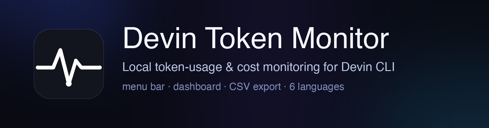

<div align="center">
  

  <p>
    <a href="https://github.com/TH-Chou/devin-usage-monitor/releases"></a>
    
    
    
  </p>

  <p>
    <b>English</b> · <a href="README.zh-CN.md">简体中文</a>
  </p>

  <p><i>Monitor local Devin CLI token usage and estimated cost —<br>
  from a native macOS app or directly inside a VS Code-compatible desktop IDE.</i></p>
</div>

---

## Why

Devin CLI records every request's token metrics in a local SQLite database —
but gives you no way to *see* them. Devin Token Monitor turns that data into a
real-time picture of what you're spending: fully local, read-only, no server,
no account, usage data stays on your machine.

## Highlights

| | |
|---|---|
| **Menu-bar live cost** | Today's estimate in the status bar; click for a summary. Close the window and it keeps running — reopen from the menu or Dock. |
| **Liquid Glass dashboard** | Native `NSWindow` + `WKWebView` (no HTTP server): KPI cards, token & cost trends (24 h / 14 d), model donut, token composition, cache hit-rate, weekday×hour heatmap, top-session ranking, cost/speed scatter. |
| **Per-request detail** | Model, latency, TTFT, tokens/s, cost — click any model, session, or request to drill down. Response bodies lazy-load so snapshots stay light. |
| **Editable pricing** | ~140 models with per-1M input/output/cache prices in `prices.json`; exact → prefix → family matching, reasoning-effort aware. |
| **Budget alerts** | Optional `daily_budget` posts a macOS notification once per day. |
| **CSV export** | Requests / sessions / daily / models via a native save panel, ⌘E, or the web API. |
| **Six languages** | 中文 · English · 日本語 · 한국어 · Español · Tiếng Việt — persisted, applied to web view *and* native chrome. |
| **Auto refresh** | Incremental `row_id` watermark polling (~15 s); launch-time full aggregation ≈ 0.3 s. |
| **IDE extension** | VSIX for desktop VS Code and compatible IDEs: status-bar cost, dashboard Webview, database picker, price-table editing, and CSV export. |
| **Six visual themes** | System, Midnight, Graphite, Warm Paper, Deep Ocean, and Forest palettes; choice persists across app sessions. |
| **Token analytics** | Rolling 7/30-day and month-to-date summaries, run-rate projection, estimated cache savings, output efficiency, model comparisons, and P50/P90 request-size and latency distributions. |

## Install

Grab `DevinTokenMonitor-<version>.dmg` from
[**Releases**](https://github.com/TH-Chou/devin-usage-monitor/releases),
drag the app into `Applications`, and launch.
It's unsigned — on first launch use right-click → **Open**.

> **Requirements:** macOS 12+, and local Devin CLI data at
> `~/.local/share/devin/cli/sessions.db` (present once you've used Devin).

## VS Code-compatible IDEs

Build and install the VSIX from source:

```bash
cd vscode-extension
npm install
npm run package
code --install-extension devin-token-monitor-0.2.8.vsix
```

Then run **Devin Token Monitor: Open Dashboard** from the Command Palette. Requires Python 3.10+ on the local machine. Cursor supports VSIX-compatible extensions; Windsurf and other forks may vary by version and extension-install policy. Browser-only VS Code (`vscode.dev` / `github.dev`) is not supported because it cannot spawn the local Python worker or access the local SQLite database. See [`vscode-extension/README.md`](vscode-extension/README.md) and [the compatibility research](vscode-extension/RESEARCH.md).

## Build the macOS app from source

```bash
python3 -m venv .venv && .venv/bin/pip install -r requirements.txt

.venv/bin/python -m devin_token_monitor.gui   # native window app
./run.sh                                       # menu-bar app + web dashboard (:7878)
.venv/bin/python -m devin_token_monitor.cli   # one-shot text report

./build_app.sh && ./build_dmg.sh              # package .app + .dmg
./install_login_agent.sh                       # optional: launch at login (--remove to undo)
```

## How it works

Devin CLI persists every session message as JSON in
`~/.local/share/devin/cli/sessions.db` (SQLite, WAL). Assistant reasoning
messages carry `metadata.metrics` — `input_tokens`, `output_tokens`,
`cache_read_tokens`, `cache_creation_tokens`, `generation_model`,
`request_id`, timestamps. The monitor opens the DB **read-only**, polls on an
incremental `row_id` watermark, and deduplicates replicated message-tree
records by `request_id` (fallback: `message_id`).

The native app pushes snapshots through `evaluateJavaScript` and receives
page actions over `webkit.messageHandlers`. The IDE extension uses a local
Node extension host and a bundled Python worker over newline-delimited stdio
JSON; it reuses the same aggregation modules and dashboard without opening a
local HTTP port.

> **Note:** Devin credits/ACU are server-side and not in the local DB —
> the app counts *tokens* and *estimates* cost from `prices.json`.

## Configuration

`prices.json` resolves in order:
`$DTM_PRICES` → `~/.devin-token-monitor/prices.json` → bundled app resource →
repo copy. `settings.daily_budget` enables alerts; `settings.language` picks
the UI language.

| Env var | Purpose | Default |
|---|---|---|
| `DEVIN_SESSIONS_DB` | Override DB path | `~/.local/share/devin/cli/sessions.db` |
| `DTM_PORT` / `DTM_HOST` | Web dashboard bind (menu-bar mode) | `7878` / `127.0.0.1` |
| `DTM_PRICES` | Override `prices.json` path | auto |

## Privacy

Everything stays on your Mac. The database is opened read-only, snapshots
never leave the process, and the only outward action is an optional
`osascript` budget notification.

## Project layout

```
devin_token_monitor/
  db.py          read-only sessions.db access + row fetch
  pricing.py     price-table loading & cost math (multi-path resolution)
  aggregator.py  watermark-based incremental aggregation
  dashboard.py   shared dashboard page (web & app frontends)
  exporter.py    CSV export (requests / sessions / daily / models)
  web.py         stdlib HTTP server + JSON API (menu-bar mode)
  gui.py         native window app (NSWindow + WKWebView + status item)
  app.py         rumps menu-bar app (embeds the web server)
  cli.py         one-shot text report
vscode-extension/ VS Code-compatible VSIX (Node host + bundled Python worker)
gui_entry.py     py2app entry point     setup_gui.py   py2app config + icon
tools/           PIL icon & banner generators
assets/          AppIcon.icns, source PNGs, README banner
build_app.sh     build .app             build_dmg.sh   build the DMG
prices.json      editable price table (+ settings)
```

## License

[Apache-2.0](LICENSE)
